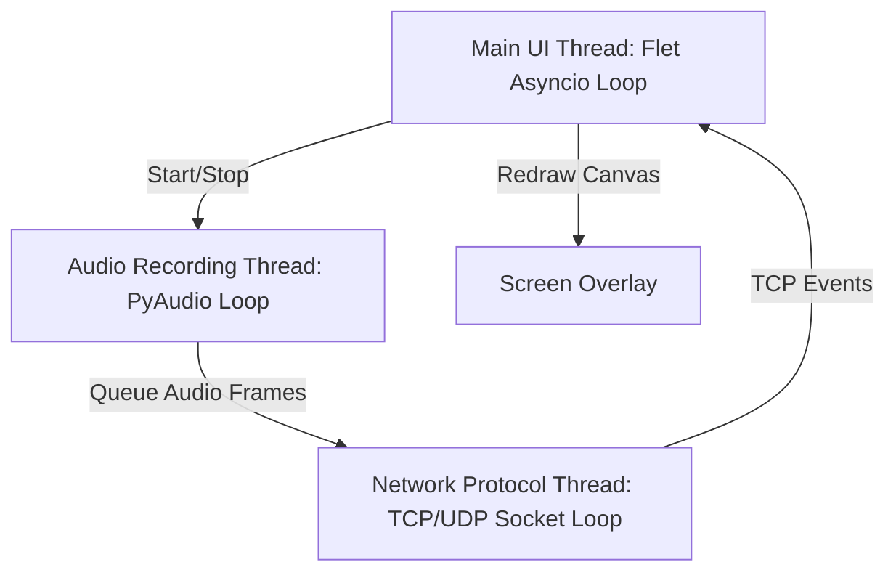

# Asynchronous Coordination in Voice Satellites

## Overview
A real-time voice assistant client like WinVE must manage several concurrent operations:
1. **Audio Capture Loop**: Reading microphone blocks continuously without dropping frames (CPU-bound/blocking).
2. **Network I/O**: Streaming voice packets over UDP to Home Assistant, listening for TCP commands (I/O-bound/blocking).
3. **UI Loop (Flet/Flutter)**: Rendering animations, HUD transcripts, and handling mouse/keyboard events (Event-driven).

If these loops are not properly isolated, the UI will lag, or audio buffer overflows will occur, causing crackling audio and failed wake word recognition.

## Threading Architecture in WinVE
WinVE segregates tasks into three primary threads or processes:

### 1. The Main UI Thread (Flet Event Loop)
- Flet operates on an asynchronous event loop (based on Python's `asyncio`).
- All user-initiated events (like click handler functions or sliding toggles) must execute quickly. Any blocking calls (such as `time.sleep()` or waiting on network sockets) inside a Flet event handler will freeze the entire interface.
- Solution: Run long-running tasks in background threads and dispatch changes to the Flet page via thread-safe callbacks (`page.run_task` or `page.update_async`).

### 2. Audio Capture Thread (PyAudio Recorder)
- Reading from PyAudio (`stream.read()`) is a blocking operations.
- This recorder loop runs in its own dedicated daemon thread.
- As new audio chunks are read, they are pushed into a thread-safe Queue (`queue.Queue`) or immediately processed by the local wake word engine.
- To prevent memory leaks or CPU spikes, the queue is size-limited (e.g. `maxsize=50`). If network lag halts consumption, older audio frames are discarded rather than letting the memory usage grow.

### 3. Network Communication Thread (Socket Loop)
- The TCP client and UDP streaming loop run in a separate thread.
- **TCP Socket**: Listens for Home Assistant connection updates. Uses `select.select` or non-blocking sockets with small timeouts to check for network data without locking up the thread.
- **UDP Streaming**: Pulls raw PCM chunks from the audio queue and writes them directly to the UDP socket. This isolation ensures network retransmissions or latency spikes do not impact PyAudio's recording thread.

## Sharing State Safely
To communicate state changes (e.g., when the network thread receives a "listening" event and needs the UI to show an animation):
1. **Thread-Safe Callbacks**: Pass functions that schedule UI updates on Flet's event loop using `asyncio.run_coroutine_threadsafe`.
2. **Atomic Flags**: Use Python `threading.Event` objects (like `is_recording` or `stop_requested`) to signal shutdown sequences across threads cleanly.
3. **Locks**: Use `threading.Lock` when modifying shared configuration dictionaries to prevent race conditions.
